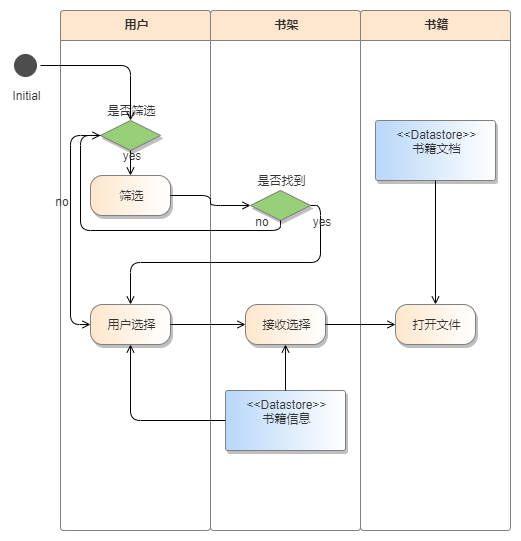
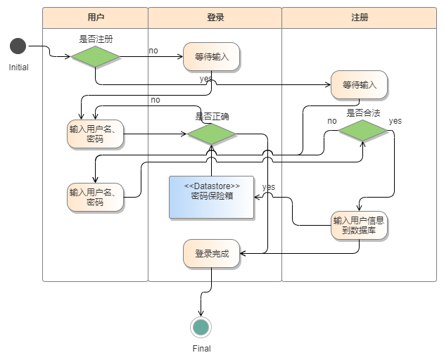
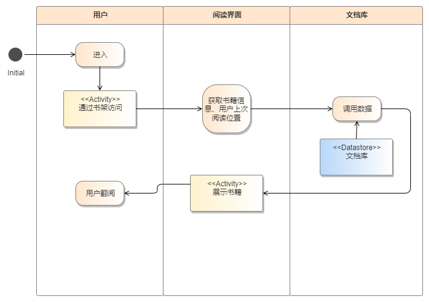
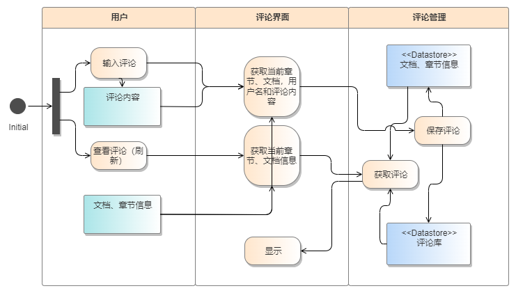

# 软件需求规格说明书

[TOC]

## 1 范围

### 1.1 标识

系统名称： 阅读平台
版本号： 1.0
发行号： 2024.4.10
缩略语： RP

### 1.2 系统概述

本系统旨在打造一个为Hello Kitty整备室量身定制的在线阅读和文档分享平台。该平台旨在满足日益增长的无纸化办公需求，为用户提供一个高效、便捷的文档交流与分享环境。通过该平台，用户可以轻松上传、浏览、下载和分享各类操作文档、图纸等重要资料，极大地提升了工作效率和协作能力。

在未来发展规划中，我们计划逐步拓展平台功能，以满足更广泛的用户需求。例如，考虑将平台功能延伸至民用读书领域，为用户提供更加丰富的阅读资源和学习体验。

在平台设计方面，我们将重点关注用户界面的易用性和视觉效果。通过优化界面布局、提升交互体验以及采用美观大方的视觉设计，旨在为用户带来更加舒适、愉悦的使用感受。同时，平台将支持多种设备终端的访问，确保用户在不同场景下都能轻松使用。

### 1.3 文档概述

本需求分析文档旨在详细阐述网页阅读平台项目的各项需求，确保项目的顺利实施和最终交付物的质量。本文档将作为项目后续开发、测试、验收等阶段的重要依据，并与项目计划书文档相互补充，共同构成项目的完整规划。

### 1.4 基线

本需求分析文档基于当前收集到的用户需求，结合现有技术水平和项目资源，确定了网页阅读平台的基本功能框架和技术实现方案。

## 2 引用文件

暂无

## 3 需求

> 本章应分以下几条描述 CSCI需求,也就是,构成 CSCI验收条件的 CSCI的特性。CSCI需求是为了满足分配给该 CSCI的系统需求所形成的软件需求。给每个需求指定项目唯一标识符以支持测试和可追踪性。并以一种可以定义客观测试的方式来陈述需求。如果每个需求有关的合格性方法和对系统(若适用,子系统)需求的可追踪性(见 5)在相应的章中没有提供,则在此进行注解。描述的详细程度遵循以下规则:应包含构成 CSCI验收条件的那些 CSCI特性,需方愿意推迟到设计时留给开发方说明的那些特性。如果在给定条中没有需求的话,本条应如实陈述。如果某个需求在多条中出现,可以只陈述一次而在其他条直接引用。

### 3.1 所需的状态和方式

> 如果需要 CSCI在多种状态和方式下运行,且不同状态和方式具有不同的需求的话,则要标识和定义每一状态和方式,状态和方式的例子包括:空闲、准备就绪、活动、事后分析、培训、降级、紧急情况和后备等。状态和方式的区别是任意的,可以仅用状态描述 CSCI,也可以仅用方式、方式中的状态,状态中的方式或其他有效方式描述。如果不需要多个状态和方式,不需人为加以区分,应如实陈述:如果需要多个状态或方式,还应使本规格说明中的每个需求或每组需求与这些状态和方式相关联,关联可在本条或本条引用的附录中用表格或其他的方法表示,也可在需求出现的地方加以注解。

### 3.2 需求概述

#### 3.2.1 目标

- 提供一个多用户能同时在线使用的网页阅读平台。
- 建立一个友好且直观的用户界面，以提升用户体验。
- 对于单位内部工作，具备站内交流的功能。
- 对于个人用户，能够推广热门文档，提高用户粘性和活跃度。
- 搭建高效且稳定的服务器架构，确保数据安全性和快速的访问速度。
- 实现跨平台兼容性，支持PC、移动设备等多种终端访问。
- 本系统是一个独立的阅读平台。

为了达成这些目标，本系统将提供以下功能，方便用户阅读、交流文档内容：

1. 账户管理：提供用户注册、登录、个人信息管理等功能，确保用户信息的准确性和安全性。
2. 文档发布与阅读：支持用户上传、编辑、发布各类文档，并提供多种阅读模式，满足不同场景下的阅读需求。
3. 站内信：实现用户之间的实时通信，方便用户之间的沟通和协作。
4. 作者评价：允许文档作者获取对其作品的评价，以了解文档的质量和受欢迎程度，并据此改进。
5. 文档评论与评分：读者可以对文档进行评论和评分，为其他用户提供参考，同时帮助作者收集反馈。
6. 读者批注功能：读者在阅读文档时，可以对关键内容进行批注，记录个人理解或疑问，便于日后回顾或与作者及其他读者交流。

考虑到文档阅读系统需要大量信息的传递、讲求实时性、维护需求高的特点，提供以下事件处理和数据流程：

**简要的事件处理流程**：

1. **接收报告**：系统接收用户关于文档操作、功能使用等问题的报告。
2. **评估分类**：处理团队评估事件的紧急程度和影响，进行优先级分类。
3. **响应处理**：针对高优先级事件，团队迅速响应，收集信息并制定应急措施。
4. **恢复总结**：事件处理后，恢复系统正常运行，并总结事件原因和处理经验。

**简要的数据流程**：

1. **上传存储**：用户上传文档，系统验证、转换后存储在数据库或文件系统中。
2. **访问处理**：用户请求文档时，系统根据权限检索数据，处理后展示给用户。
3. **共享评论**：用户分享文档或添加评论，系统更新记录并与其他用户互动。

>- 本系统的开发意图、应用目标及作用范围(现有产品存在的问题和建议产品所要解决的问题)。
>- 本系统的主要功能、处理流程、数据流程及简要说明。
>- 表示外部接口和数据流的系统高层次图。说明本系统与其他相关产品的关系,是独立产品还是一个较大产品的组成部分(可用方框图说明)。//产品本身的特点

#### 3.2.2 运行环境

- **服务器端**：平台服务器应能在当前主流的操作系统，Windows Server, Linux发行版和macOS上稳定运行，并且能够正常接入数据库系统MySQL。
- **客户端**：平台应兼容当前主流的网页浏览器Chrome, Firefox, Safari, Edge等，并且能在Android和iOS等移动设备操作系统上通过标准浏览器进行无障碍访问。

#### 3.2.3 用户的特点

- **多样性**：对于B端（企业用户），系统需要提供各部门交流操作文档和图纸等工作环节的良好接口；未来如果系统还会面对C端（个人用户），则用户可能来自不同的年龄层，具备不同的使用熟练程度和阅读需求。
- **交互性**：用户期望一个能够提供互动交流的平台，如评论、收藏、转发、站内信等功能。
- **个性化**：用户希望平台能提供个性化的阅读推荐和界面定制选项，以满足用户对个性化阅读的需求。

#### 3.2.4 关键点

**关键功能**

1. **阅读器（读者）**

2. **创作者面板（创作者）**

3. **文档库管理**：

   - 平台应具备一个完善的文档库，能够存储、管理和检索各类文档。

   - 文档库应按照分类进行组织，并提供搜索功能，方便用户快速定位到感兴趣的文档。

1. **标签与分类检索**：
   - 用户可以方便地切换不同的标签和分类来浏览文档。
   - 在大栏目内，用户应能选择更细致的分类进行检索，以满足不同用户的需求。
2. **文档展示与推荐**：
   - 文档展示应包含题目、标签、作者、简介、热度等基本信息，以反映文档的口碑和概况。
   - 平台应具备推荐系统，能够宣传热门文档和推广其他相关文档，提高文档的曝光率和用户的阅读兴趣。
3. **文档主页与详情展示**：
   - 每个文档都应有一个主页，详细展示文档的质量和内容特色，包括完整的文档内容、格式、图片等。
   - 文档主页应提供评论区，允许用户对文档进行评论和交流，增强用户之间的互动。
4. **章节级评论区**：
   - 除了文档主页的评论区外，每个独立发布的章节也应设有评论区，以便用户对特定章节进行讨论和反馈。
5. **用户交互与反馈**：
   - 用户应能在平台上进行各种交互操作，如点赞、踩、举报等，以提升用户参与感和平台活跃度。
   - 平台应收集并分析用户反馈，不断优化文档库和用户体验。

通过推荐系统和用户交互功能，平台还能达成推广热门文档，提高用户粘性和活跃度的目的。在实现这些功能时，需要优化数据结构的设计、搜索算法、用户界面的友好性以及系统的稳定性和安全性。

#### 3.2.5 约束条件

- **技术约束**：开发团队必须考虑现有技术水平，确保所选择的技术栈能够满足项目的长期需求和扩展性。
- **时间约束**：项目的实施应遵循预定的时间表，确保按时交付。
- **成本约束**：项目的开发和运营成本应在预算范围内。
- **法规约束**：平台必须符合当地和国际的数据保护、版权及信息安全等相关法律法规。

### 3.3 ==需求规格==

#### 3.3.1 软件系统总体功能/对象结构

> 对软件系统总体功能/对象结构进行描述,包括结构图、流程图或对象图。

本软件系统的总体目标是提供一个功能全面、用户友好的网页阅读平台，支持多用户在线阅读、交流和互动。系统需构建一个完善的文档库，通过分类和搜索功能帮助用户快速定位感兴趣的文档。此外，系统还需实现用户管理、文档发布、文档阅读、站内信等基本功能，并保障数据的安全性和访问速度。

对象结构方面，系统主要包括用户（User）、文档（Document）、评论（Comment）、站内信（Message）等核心对象。用户对象负责管理用户信息，包括注册、登录、信息修改等；文档对象负责存储和管理文档内容，包括文档的发布、编辑、删除等；评论对象用于记录用户对文档的评论信息；站内信对象则支持用户之间的消息传递。

#### 3.3.2 软件子系统功能/对象结构

> 对每个主要子系统中的基本功能模块/对象进行描述,包括结构图,流程图或对象图。

**view-control第一层：**

1. **推荐界面子系统**
2. **分类界面子系统**
3. **页面导航子系统**

**view-control第二层：**

1. **个人中心子系统**
2. **创作中心子系统**
3. **书架子系统**
   -  
   - 功能：实现用户查找并阅读个人书架中的书籍
   - 对象结构：用户、书架、书籍
4. **登录、注册子系统**
   -  
   - 功能：实现用户的登录和注册
   - 对象结构：用户、登录、注册
5. **站内信子系统**
  - 功能：实现用户之间的消息发送、接收、回复等功能，支持用户之间的实时交流。
  - 对象结构：包括站内信（Message）、用户（User）等对象。站内信对象负责存储和管理用户之间的消息内容，用户对象则用于标识消息的发送者和接收者。
6. **详细页子系统**

**view-control第三层：**

1. **阅读器子系统**

   -  
   - 功能：让用户能够阅读文档
   - 对象结构：用户、阅读界面、文档库

2. **评论区子系统**

  -  

  - 功能：允许用户对文档进行评论和交流，增强用户之间的互动。

  - 对象结构：主要包括评论（Comment）、用户（User）等对象。评论对象负责存储用户的评论内容和相关信息，用户对象则标识评论的发布者。

**model层：**
1. **账户管理子系统**
	- 功能：提供用户注册、登录、信息修改、密码重置等功能，确保用户信息的安全性和准确性。
	- 对象结构：包括用户（User）和用户信息（UserInfo）对象。用户对象负责用户的身份验证和授权，用户信息对象则存储用户的详细资料。
2. **文档管理子系统**
   - 功能：支持管理员上传、编辑、发布文档内容，同时为用户提供文档浏览、搜索、收藏、评论等功能。
   - 对象结构：主要包括文档（Document）、文档分类（Category）、文档标签（Tag）等对象。文档对象负责存储文档内容和相关信息，文档分类和标签对象则用于对文档进行归类和检索。

#### 3.3.3 描述约定

在本文档中，为了确保清晰、一致地描述需求和设计，我们采用以下描述约定：

1. **数学符号**：

   * 变量和参数名称通常使用小写字母表示，如 `x`, `y`, `z` 等。
   * 矩阵和向量通常使用大写字母表示，如 `A`, `B`, `X` 等。
   * 运算符号遵循标准的数学符号，如 `+` 表示加法，`-` 表示减法，`*` 表示乘法，`/` 表示除法等。

2. **度量单位**：

   	* 除非特别说明，否则所有长度和距离的度量单位默认为毫米（mm）。
	* 时间的度量单位默认为秒（s）。
   	* 速度的度量单位默认为米每秒（m/s）。
	* 质量的度量单位默认为千克（kg）。
  	* 数据的存储量单位默认为字节（Byte），可能会使用到更大的单位如千字节（KB）、兆字节（MB）或吉字节（GB）等。
	* 阅读量
   	* 热度与评分
	* 作者的等级

3. **专业术语**：

   * “用户”指的是使用本软件平台的个体或实体。

   * “文档”指的是在平台上发布、阅读和交流的文本信息内容。

   * “子系统”指的是软件系统中具有特定功能或业务逻辑的部分。

4. (代码)**格式与排版**：

   * 代码块和命令行输入使用等宽字体表示，如 `code` 或 `command`。

   * 重要的术语或概念可能使用**粗体**或_斜体_来强调。

5. **缩写与简写**：
   * 常用的缩写和简写应在首次使用时进行解释，如“UI”代表“用户界面”，“UX”代表“用户体验”等。

6. **其他说明**：

   * 当提到某个具体数值或范围时，会明确说明其单位，如“500毫秒的响应时间”或“10MB的存储空间”。

   * 对于需要特别说明或强调的内容，会使用括号、注释或脚注等方式进行额外说明。

7. **函数参数**：

   - 函数参数在文档中通常表示为“参数名: 参数类型”的形式。例如，“userId: int”表示一个名为userId的整数类型参数。

   - 当描述函数时，函数的参数列表会明确列出，每个参数的名称、类型和描述都会被清晰给出。

   - 如果函数参数有默认值，它将在参数描述中明确标注。

   - 对于复杂类型的参数（如对象、数组等），将详细描述其结构和预期的属性值。

以上描述约定适用于本文档中的所有内容，旨在确保读者能够准确、无误地理解文档中的信息。如有任何疑问或需要进一步解释的内容，请随时联系文档的作者或维护者。

### 3.4 ==CSCI能力需求==

#### 3.4.1 账户管理能力

- 系统必须能够验证用户身份，包括用户名、密码和其他认证信息。
- 系统必须能够区分用户角色和权限，如普通用户、管理员等。
- 系统必须具备密码重置和账户锁定功能，以提高安全性。

#### 3.4.2 文档发布能力

- 用户应具备上传文档的权限，并能指定文档的分类、标签、作者等信息。
- 系统应支持多种文档格式的上传和显示，如PDF、Word等。
- 发布文档后，系统应生成文档链接或唯一标识符，便于分享和查找。

#### 3.4.3 文档阅读能力

- 用户应能够在平台上浏览和搜索文档，支持按分类、标签、热度等方式进行排序和过滤。
- 系统应提供基本的阅读功能，如上下翻页、书签、高亮等。
- 阅读器应支持私密和共享标签，用户可以选择开启或关闭这些标签。

#### 3.4.4 站内信能力

- 系统应提供站内信功能，用户可以发送、接收和管理站内消息。
- 消息应具备分类、标记、搜索等基本功能，便于用户管理沟通。

### 3.5 CSCI外部接口需求

#### 3.5.1 用户接口

- 用户界面应简洁直观，支持不同设备和屏幕尺寸的适配。
- 用户应能够方便地进行文档搜索、阅读、上传等操作。
- 用户界面应具备个性化设置功能，允许用户自定义界面主题、字体大小等。

#### 3.5.2 硬件接口

- 系统应与常见硬件设备兼容，如PC、平板、手机等。
- 对于上传和下载文档的操作，系统应兼容不同的存储设备，如U盘、云存储等。

#### 3.5.3 软件接口

- 系统应与常见操作系统兼容，如Windows、MacOS、iOS、Android等。
- 对于文档的转换和格式化，系统应支持常见的文档处理软件，如Adobe Acrobat、Microsoft Office等。

#### 3.5.4 通信接口

- 系统应支持安全的通信协议，如HTTPS，以保障数据传输的安全性。
- 对于站内信功能，系统应支持实时的消息传递和通知，确保用户及时接收到重要消息。

#### 3.5.x （接口的项目唯一标识符）

本条(从 3.5.2开始)应通过项目唯一标识符标识 CSCI的外部接口,简单地标识接口实体,根据需要可分条描述为实现该接口而强加于 CSCI的需求。该接口所涉及的其他实体的接口特性应以假设或“当(未提到实体)这样做时,CSCI将……”的形式描述,而不描述为其他实体的需求。本条可引用其他文档(如:数据字典、通信协议标准,用户接口标准)代替在此所描述的信息。(若适用)需求应包括下列内容,它们以任何适合于需求的顺序提供,并从接口实体的角度说明这些特性的区别(如对数据元素的大小、频率或其他特性的不同期望):

- CSCI必须分配给接口的优先级别；
- 要实现的接口的类型的需求(如:实时数据传送,数据的存储和检索等)；
- CSCI必须提供、存储、发送、访问、接收的单个数据元素的特性,如：
  1. 名称/标识符:
     - 项目唯一标识符；
     - 非技术(自然语言)名称；
     - 标准数据元素名称
     - 技术名称(如代码或数据库中的变量或字段名称)；
     - 缩写名或同义名；
  2. 数据类型(字母数字、整数等)；
  3. 大小和格式(如:字符串的长度和标点符号)；
  4. 计量单位(如:米、元、纳秒)；
  5. 范围或可能值的枚举(如:0~99)；
  6. 准确度(正确程度)和精度(有效数字位数)；
  7. 优先级别、时序、频率、容量、序列和其他的约束条件,如,数据元素是否可被更新和业务规则是否适用；
  8. 保密性和私密性的约束；
  9. 来源(设置/发送实体)和接收者(使用/接收实体)；
- CSCI必须提供、存储、发送、访问、接收的数据元素集合体(记录、消息、文件、显示和报表d等)的特性,如：
  1. 名称/标识符:
     - 项目唯一标识符；
     - 非技术(自然语言)名称；
     - 技术名称(如代码或数据库的记录或数据结构)；
     - 缩写名或同义名；
  2. 数据元素集合体中的数据元素及其结构(编号、次序、分组)；
  3. 媒体(如盘)和媒体中数据元素/数据元素集合体的结构；
  4. 显示和其他输出的视听特性(如:颜色、布局、字体、图标和其他显示元素、蜂鸣器以及亮度等)；
  5. 数据元素集合体之间的关系。如排序/访问特性；
  6. 优先级别、时序、频率、容量、序列和其他的约束条件,如:数据元素集合体是否可被修改和业务规则是否适用；
  7. 保密性和私密性约束；
  8. 来源(设置/发送实体)和接收者(使用/接收实体)；
- CSCI必须为接口使用通信方法的特性。如：
  1. 项目唯一标识符；
  2. 通信链接/带宽/频率/媒体及其特性；
  3. 消息格式化；
  4. 流控制(如:序列编号和缓冲区分配)；
  5. 数据传送速率,周期性/非周期性,传输间隔；
  6. 路由、寻址、命名约定；
  7. 传输服务,包括优先级别和等级；
  8. 安全性/保密性/私密性方面的考虑,如:加密、用户鉴别、隔离和审核等；
- CSCI必须为接口使用协议的特性，如:
  1. 项目唯一标识符；
  2. 协议的优先级别/层次；
  3. 分组,包括分段和重组、路由和寻址；
  4. 合法性检查、错误控制和恢复过程；
  5. 同步,包括连接的建立、维护和终止；
  6. 状态、标识、任何其他的报告特征；
- 其他所需的特性,如:接口实体的物理兼容性(尺寸,容限、负荷、电压和接插件兼容性等)。

### 3.6 CSCI内部接口需求

#### 3.6.1 数据库接口

- 系统应与内部数据库进行有效的数据交互，包括文档存储、用户信息管理等。
- 数据库接口应支持数据的增删改查操作，保证数据的一致性和完整性。

#### 3.6.2 后端接口

- 后端接口应与前端用户界面进行有效的通信，确保用户操作能够及时反馈和处理。
- 系统应支持灵活的接口设计，便于未来功能的扩展和升级。

### 3.7 ==CSCI内部数据需求==

#### 3.7.1 数据存储需求

- 系统应具备足够的存储空间，支持大规模文档和用户数据的存储。
- 数据存储应具备高效的读写速度，以提供流畅的用户体验。

#### 3.7.2 数据管理需求

- 系统应支持对数据的备份、恢复和清理，保证数据的安全和可靠性。
- 对于敏感数据，系统应采取加密等措施进行保护。

### 3.8 适应性需求

(若有)本条应指明要求 CSCI提供的、依赖于安装的数据有关的需求(如:依赖现场的经纬度)和要求 CSCI使用的,根据运行需要进行变化的运行参数(如:表示与运行有关的目标常量或数据记录的参数)。

### 3.9 保密性需求

(若有)本条应描述有关防止对人员、财产、环境产生潜在的危险或把此类危险减少到最低的CSCI需求,包括:为防止意外动作(如意外地发出“自动导航关闭”命令)和无效动作(发出一个想要的“自动导航关闭”命令时失败)CSCI必须提供的安全措施。

### 3.10 保密性和私密性需求

(若有)本条应指明保密性和私密性的 CSCI需求,包括:CSCI运行的保密性/私密性环境、提供的保密性或私密性的类型和程度、CSCI必须经受的保密性/私密性的风险、减少此类危险所需的安全措施、CSCI必须遵循的保密性/私密性政策、CSCI必须提供的保密性/私密性审核,保密性/私密性必须遵循的确证/认可准则。

### 3.11 ==CSCI环境需求==
### CSCI 运行环境需求

#### 1. 计算机硬件要求
- **处理器**：支持32位或更高架构的处理器。
- **内存**：建议至少512MB RAM，以确保系统运行的流畅性和性能。
- **存储空间**：至少50MB的可用磁盘空间，用于安装和运行 CSCI。

#### 2. 操作系统要求
- **操作系统**：支持以下任一操作系统：
  - Windows：Windows 7或更新版本。
  - macOS：macOS 10.10（Yosemite）或更新版本。
  - Linux：常见的Linux发行版，如Ubuntu、Debian、CentOS等。
- **架构支持**：软件应该能够在x86、x86-64或相应的处理器架构上运行。

#### 3. 其他软件依赖项
- **运行时环境**：根据所选的编程语言和开发框架，可能需要安装相应的运行时环境。
- **图形用户界面（GUI）库**：如果 CSCI 需要图形界面，则可能需要安装相应的 GUI 库，如Qt、GTK+等。

#### 4. 推荐配置
- **处理器**：双核处理器或更高。
- **内存**：建议1GB或更高RAM。
- **显示器**：支持至少1024x768分辨率的显示器，以确保良好的用户体验。

### 3.12 计算机资源需求

#### 3.12.1 计算机硬件需求

本条应描述 CSCI使用的计算机硬件需求,(若适用)包括,各类设备的数量、处理器,存储器、输人/输出设备、辅助存储器、通信/网络设备和其他所需的设备的类型,大小,容量及其他所要求的特征。

#### 3.12.2 计算机硬件资源利用需求

本条应描述 CSCI计算机硬件资源利用方面的需求,如:最大许可使用的处理器能力、存储器容量、输入/输出设备能力、辅助存储器容量、通信/网络设备能力。描述(如每个计算机硬件资源能力的百分比)还包括测量资源利用的条件。

#### 3.12.3 计算机软件需求

本条应描述 CSCI必须使用或引人 CSCI的计算机软件的需求,例如包括:操作系统、数据库管理系统、通信/网络软件、实用软件、输入和设备模拟器、测试软件、生产用软件。必须提供每个软件项的正确名称、版本、文档引用。

#### 3.12.4 计算机通信需求

本条应描述 CSCI必须使用的计算机通信方面的需求,例如包括:连接的地理位置、配置和网络拓扑结构、传输技术、数据传输速率、网关、要求的系统使用时间、传送/接收数据的类型和容量、传送/接收/响应的时间限制、数据的峰值、诊断功能。

### 3.13 ==软件质量因素==

### 软件质量因素需求

#### 1. 功能性
- **完整性**：CSCI 必须实现合同中标识的所有功能，并能够满足用户需求。
- **准确性**：CSCI 应当产生正确的结果，与用户的期望一致。
- **适应性**：CSCI 应当能够适应不同的使用场景和用户需求，提供灵活的功能定制和配置选项。

#### 2. 可靠性
- **稳定性**：CSCI 应当具备稳定性，能够在各种环境和条件下产生一致的结果。
- **容错性**：CSCI 应当具备容错机制，能够处理异常情况并进行恢复，避免系统崩溃或数据丢失。

#### 3. 可维护性
- **可读性**：CSCI 的代码应当具备良好的可读性，易于理解和修改。
- **可测试性**：CSCI 应当设计为易于测试的系统，能够进行全面的测试覆盖。
- **可扩展性**：CSCI 应当具备可扩展的架构，便于在未来进行功能扩展和修改。

#### 4. 可用性
- **响应性**：CSCI 应当具备良好的响应速度，快速响应用户操作和请求。
- **可访问性**：CSCI 应当易于访问和操作，无论是通过图形界面还是命令行接口。

#### 5. 灵活性
- **适应性**：CSCI 应当具备适应需求变化的能力，能够快速灵活地调整和修改。
- **配置性**：CSCI 应当提供灵活的配置选项，允许用户根据需要进行定制和调整。

#### 6. 可移植性
- **平台独立性**：CSCI 应当具备平台独立性，能够在不同的操作系统和硬件平台上运行。
- **环境适应性**：CSCI 应当能够适应不同的运行环境和条件，包括网络环境和硬件配置的变化。

#### 7. 可重用性
- **组件复用**：CSCI 应当设计为可重用的组件，能够被多个应用程序共享和复用。
- **代码重用**：CSCI 应当鼓励代码重用，避免重复开发和维护相似的功能模块。

### 3.14 设计和实现的约束

(若有)本条应描述约束CSCI设计和实现的那些需求。这些需求可引用适当的标准和规范例如需求包括：

- 特殊 CSCI体系结构的使用或体系结构方面的需求,例如:需要的数据库和其他软件配置项；标准部件、现有的部件的使用；需方提供的资源(设备、信息、软件)的使用；
- 特殊设计或实现标准的使用;特殊数据标准的使用;特殊编程语言的使用；
- 为支持在技术、风险或任务等方面预期的增长和变更区域,必须提供的灵活性和可扩展性。

### 3.15 数据

说明本系统的输入,、输出数据及数据管理能力方面的要求(处理量、数据量)。

### 3.16 操作

说明本系统在常规操作、特殊操作以及初始化操作、恢复操作等方面的要求。

### 3.17 故障处理

说明本系统在发生可能的软硬件故障时,对故障处理的要求。包括：

- 说明属于软件系统的问题；
- 给出发生错误时的错误信息；
- 说明发生错误时可能采取的补救措施。

### 3.18 算法说明

用于实施系统计算功能的公式和算法的描述。包括:

- 每个主要算法的概况；
- 用于每个主要算法的详细公式。

### 3.19 有关人员需求

暂无

### 3.20 有关培训需求

暂无

### 3.21 有关后勤需求

暂无

### 3.22 其他需求

暂无

### 3.23 包装需求

暂无

### 3.24 需求的优先次序和关键程度

暂无

## 4 合格性规定

本章定义一组合格性方法,对于第3章中每个需求,指定所使用的方法,以确保需求得到满足可以用表格形式表示该信息,也可以在第3章的每个需求中注明要使用的方法。合格性方法包括：

- 演示:运行依赖于可见的功能操作的 CSCI或部分 CSCI,不需要使用仪器,专用测试设备或进行事后分析；
- 测试.使用仪器或其他专用测试设备运行 CSCI或部分 CSCI,以便采集数据供事后分析使用；
- 分析:对从其他合格性方法中获得的积累数据进行处理,例如测试结果的归约、解释或推断；
- 审查:对 CSCI代码、文档等进行可视化检查；
- 特殊的合格性方法。任何应用到CSCI的特殊合格性方法,如:专用工具、技术、过程、设施、验收限制。

## 5 需求可追踪性

本章应包括：

- 从本规格说明中每个 CSCI的需求到其所涉及的系统(或子系统)需求的可追踪性。(该可追踪性也可以通过对第3章中的每个需求进行注释的方法加以描述)*

  注:每一层次的系统细化可能导致对更高层次的需求不能直接进行追踪。例如:建立多个 CSCI的系统体系结构设计可能会产生有关 CSCI之间接口的需求,而这些接口需求在系统需求中并没有被覆盖,这样的需求可以被追踪到诸如”系统实现”这样的一般需求,或被追踪到导致它们产生的系统设计决策上。

- 从分配到被本规格说明中的 CSCI的每个系统(或子系统)需求到涉及它的 CSCI需求的可0.追踪性。分配到 CSC的所有系统(或子系统)需求应加以说明。追踪到IRS中所包含的CSCI需求可引用 IRS。

## 6 ==尚未解决的问题==

如需要,可说明软件需求中的尚未解决的遗留问题。

## 7 注解

本章应包含有助于理解本文档的一般信息(例如背景信息、词汇表、原理》。本章应包含为理解本文档需要的术语和定义,所有缩略语和它们在文档中的含义的字母序列表。

## 附录

附录可用来提供那些为便于文档维护而单独出版的信息(例如图表、分类数据)。为便于处理附录可单独装订成册。附录应按字母顺序(A,B等)编排。

# Brief（由文心一言生成）

**网页阅读平台需求分析文档**

**一、引言**

本需求分析文档旨在详细阐述网页阅读平台项目的各项需求，确保项目的顺利实施和最终交付物的质量。本文档将作为项目后续开发、测试、验收等阶段的重要依据，并与项目计划书文档相互补充，共同构成项目的完整规划。

设计基线：本需求分析文档基于当前收集到的用户需求，结合现有技术水平和项目资源，确定了网页阅读平台的基本功能框架和技术实现方案。

**二、需求概述**

1. **规格**

网页阅读平台应满足以下基本规格要求：

- 平台需支持多用户同时使用，提供友好的用户界面；
- 具备高效、稳定的服务器架构，保障数据安全和访问速度；
- 支持跨平台访问，包括但不限于PC端、移动端等。

2. **CSCI（软件配置项）能力**

平台应包含以下软件配置项（CSCI）：

- 账户管理模块：实现用户注册、登录、信息修改、密码重置等功能；
- 文档发布模块：支持管理员上传、编辑、发布文档内容；
- 文档阅读模块：为用户提供文档浏览、搜索、收藏、评论等功能；
- 站内信模块：实现用户之间的消息发送、接收、回复等功能。

3. **环境要求**

平台应适应以下环境要求：

- 服务器端：支持主流操作系统和数据库系统；
- 客户端：兼容主流浏览器和移动设备操作系统。

4. **CSCI环境**

CSCI的运行环境应包括：

- 服务器端环境：配置必要的硬件资源和软件服务，确保平台的稳定运行；
- 开发环境：提供开发人员所需的编程工具、框架和库文件。

5. **质量因素**

平台的质量因素包括但不限于：

- 可用性：平台应易于使用，用户能够轻松完成各项操作；
- 稳定性：平台应具有高可用性，确保长时间稳定运行；
- 安全性：平台应采取必要的安全措施，保护用户信息和文档内容的安全。

**三、合格性规定**

为确保平台满足用户需求，制定以下合格性规定：

1. 平台功能应完整实现，各项功能符合预期设计；
2. 平台性能应满足用户需求，包括响应时间、并发用户数等指标；
3. 平台应经过严格的测试，确保无重大缺陷和安全隐患；
4. 平台应符合相关法律法规和标准要求，如信息安全、版权保护等。

**四、需求可追踪性**

为确保需求的可追溯性，本需求分析文档将采用以下方法：

1. 对每个需求项进行唯一标识，并建立需求项之间的关联关系；
2. 在项目后续阶段，如设计、开发、测试等过程中，将需求项与相应的设计文档、代码、测试用例等进行关联；
3. 通过项目管理工具或文档管理工具，实现需求项的版本控制和变更管理，确保需求的一致性和准确性。

**五、总结**

本需求分析文档详细阐述了网页阅读平台项目的各项需求，包括规格、CSCI能力、环境要求、质量因素等方面。通过制定合格性规定和需求可追踪性措施，确保项目能够按照用户需求进行顺利实施，最终交付高质量的产品。

注：以上仅为需求分析文档的框架和内容概述，实际编写时还需根据具体项目情况和用户需求进行细化和补充。

# 讨论记录

## 4.17

结果：

1. 暂时不完成3.3,3.4内容，因为3.3涉及软件的具体架构，可能需要小组成员全员讨论（需要画子系统uml图等）
2. 决定将3.3以前的系统概述、需求概述的内容修改完善，不要那么千篇一律（学长建议）
3. 合规性、需求可追踪性没有充分讨论，但是大概是和前面的需求一脉相承，可以一步步来

## 4.19

画流程图、结构图，对象图