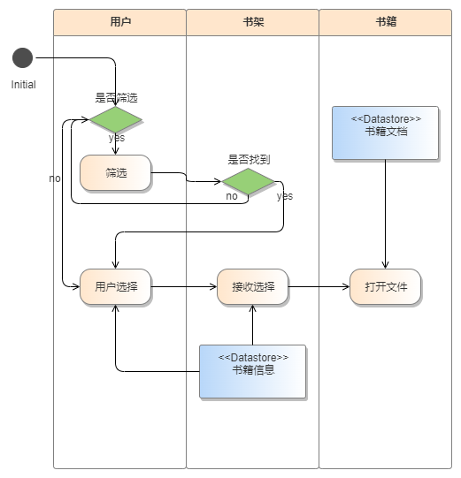
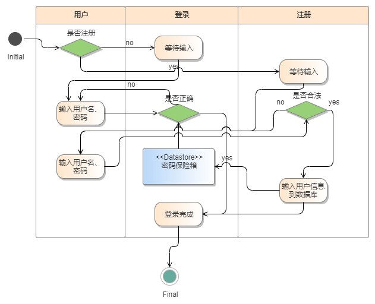
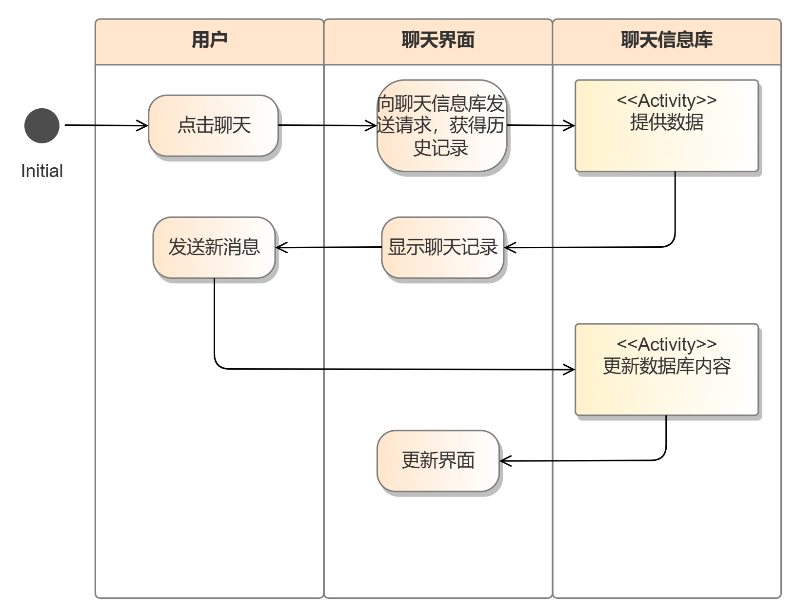
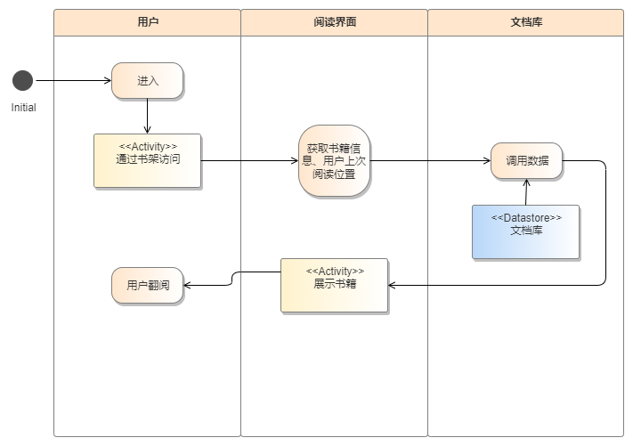
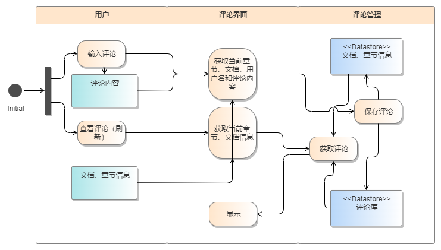

# 软件概要设计说明书

>1. 《软件概要设计说明书》(SDD)概要设计说明书又可称系统设计说明书，这里所说的系统是指程序系统。编制的目的是说明对程序 系统的设计考虑，包括程序系统的基本处理流程、程序系统的组织结构、模块划分、功能分配、接口设计、运行设计、安全设计、数据结构设计和出错处理设计等，为程序的详细设计提供基础。
>2. 本课程及本实验不涉及、不强调、不关注的部分可省略，但不允许删除已有条目。
>3. 最终文档请删除所有灰色字体和斜体等说明部分。

[Toc]

## 1 引言

### 1.1 编写目的

*说明编写这份概要设计说明书的目的，指出预期的读者。*
概要设计说明书的目的就是进一步细化软件设计阶段得出的软件概貌，描述本阶段完成系统的大致设计并说明系统的数据结构与软件结构，并把它加工成程序细节上非常接近与源程序开发的软件标识。 
预期读者：软件测试人员、程序开发员、软件分析员

### 1.2 背景

待开发软件系统的名称；阅读平台

任务提出者：？
开发者：杜嘉龙、郑玉洁、王玮宁、李益然、李正阳
用户：广大阅读爱好者与作者
运行该软件的计算站：？

### 1.3 定义

暂无

### 1.4参考设计

暂无

## 2 系统需求概述

### 2.1需求规定

输入项目：用户信息、文档、站内交流信息、读者评论、批注等。

输出项目：可阅读的文档和文档批注、读者评论、交流和文档信息的可视化等需求的实现。

处理需求：本软件系统提供了一个功能全面、用户友好的网页阅读平台，支持多用户在线阅读、交流和互动。系统需构建一个完善的文档库，通过分类和搜索功能帮助用户快速定位感兴趣的文档。

系统需要账户管理、站内信、个人书架、文档阅读、推荐文档、文档发布等基本功能，并保障数据的安全性和访问速度。

### 2.2业务目标

### 2.3运行环境

*简要地说明对本系统的运行环境（包括硬件环境和支持环境）的规定*

#### 2.3.1设备 

*列出运行该软件所需要的硬设备。说明其中的新型设备及其专门功能。*
- **处理器**：支持32位或更高架构的处理器。
- **内存**：建议至少512MB RAM，以确保系统运行的流畅性和性能。
- **存储空间**：至少50MB的可用磁盘空间，用于安装和运行 CSCI。

#### 2.3.2支持软件

*列出支持软件，包括要用到的操作系统、编译（或汇编）程序、测试支持软件等。*
Windows：Windows 7或更新版本。

macOS：macOS 10.10（Yosemite）或更新版本。

Linux：常见的Linux发行版，如Ubuntu、Debian、CentOS等。

### 2.4设计约束

### 2.5功能需求

**基本设计概念：**

包括以下几个功能

a. 文档阅读功能（详细页子系统、阅读器子系统）

b. 个人书架功能（书架子系统）

c. 推荐文档（通过推荐界面子系统、分类界面子系统、评论区子系统）

d. 站内信（站内信子系统）

e. 文档发布（创作中心子系统）

f. 基本的账户管理（个人中心子系统、登录-注册子系统）

g. 页面导航（页面导航子系统）

**处理流程从各个子系统展开：**

**个人中心子系统**

 

功能：实现站内用户管理个人信息的功能。

对象结构：包括个人中心界面（通过该界面上传文档）、个人信息库、用户。

**创作中心子系统**

 

功能：实现站内用户创作并上传文档的功能。

对象结构：包括详细页界面（通过该界面上传文档）、数据库、用户。

**书架子系统**

 

功能：实现用户查找并阅读个人书架中的书籍

对象结构：用户、书架、书籍

**登录、注册子系统**

 

功能：实现用户的登录和注册

对象结构：用户、登录、注册

**站内信子系统**

 

功能：实现用户之间的消息发送、接收、回复等功能，支持用户之间的实时交流。

对象结构：包括站内信（Message）、用户（User）等对象。站内信对象负责存储和管理用户之间的消息内容，用户对象则用于标识消息的发送者和接收者。

**view-control第三层：**

**阅读器子系统**

 

功能：让用户能够阅读文档

对象结构：用户、阅读界面、文档库

**评论区子系统**

 

功能：允许用户对文档进行评论和交流，增强用户之间的互动。

对象结构：主要包括评论（Comment）、用户（User）等对象。评论对象负责存储用户的评论内容和相关信息，用户对象则标识评论的发布者。

### 2.6非功能需求

### 2.7系统总体架构

系统用例图：

本软件系统的总体目标是提供一个功能全面、用户友好的网页阅读平台，支持多用户在线阅读、交流和互动。系统需构建一个完善的文档库，通过分类和搜索功能帮助用户快速定位感兴趣的文档。此外，系统还需实现用户管理、文档发布、文档阅读、站内信等基本功能，并保障数据的安全性和访问速度。

具备的用例有账户管理、站内信、个人书架、文档阅读、推荐文档、文档发布等，而用户包括了读者和作者。

## 3 系统接口设计

### 3.2接口设计

#### 3.2.1用户接口

*说明将向用户提供的命令和它们的语法结构，以及软件的回答信息。*

*说明提供给用户操作的硬件控制面板的定义。*

#### 3.2.2 与其他软件、硬件接口

*说明本系统同外界的所有接口的安排包括软件与硬件之间的接口、本系统与各支持软件之间的接口关系以及各个系统元素之间的接口的安排。*

### 3.3 系统数据结构设计

#### 3.3.1 逻辑结构设计要点

*给出本系统内所使用的每个数据结构的名称、标识符以及它们之中每个数据项、记录、文卷和系的标识、定义、长度及它们之间的层次的或表格的相互关系。*

#### 3.3.2 物理结构设计要点

*给出本系统内所使用的每个数据结构中的每个数据项的存储要求，访问方法、存取单位、存取的物理关系（索引、设备、存储区域）、设计考虑和保密条件。*

#### 3.3.3数据结构与程序关系

## 4 系统数据库设计

## 5 运行设计

### 5.1运行模块组合

### 5.2运行控制

### 5.3运行时间

